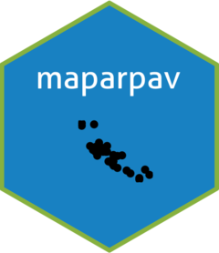

<!-- README.md is generated from README.Rmd. Please edit that file -->

# maparpav 

<!-- badges: start -->

[](https://CRAN.R-project.org/package=maparpav)
[](https://www.tidyverse.org/lifecycle/#maturing)
<!-- badges: end -->

Few times a day, ARPAV update map data on a site dedicated to UBEP, ie
<https://www.arpa.veneto.it/inquinanti/unipd/>. The goal of `{maparpav}`
is to provide utilities and functions to automatically download those
data.

## Installation

You can install the development version of `{maparpav}` from
[GitHub](https://www.github.com) with:

``` r
# install.packages("remotes)
remotes::install_github("UBESP-DCTV/maparpav")
```

## Code of Conduct

Please note that the maparpav project is released with a [Contributor
Code of
Conduct](https://contributor-covenant.org/version/2/0/CODE_OF_CONDUCT.html).
By contributing to this project, you agree to abide by its terms.
